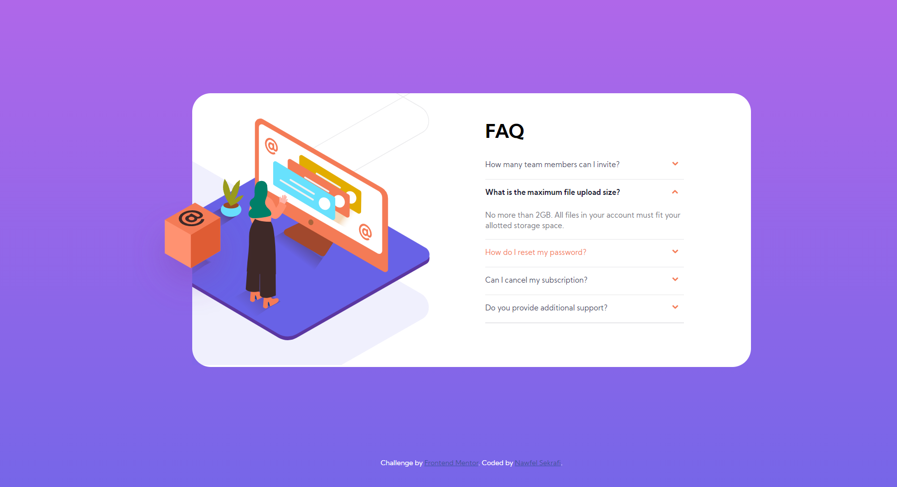

# Frontend Mentor - FAQ accordion card solution

This is a solution to the [FAQ accordion card challenge on Frontend Mentor](https://www.frontendmentor.io/challenges/faq-accordion-card-XlyjD0Oam). Frontend Mentor challenges help you improve your coding skills by building realistic projects.

## Table of contents

- [Overview](#overview)
  - [The challenge](#the-challenge)
  - [Screenshot](#screenshot)
  - [Links](#links)
- [My process](#my-process)
  - [Built with](#built-with)
  - [What I learned](#what-i-learned)
  - [Continued development](#continued-development)
  - [Useful resources](#useful-resources)
- [Author](#author)
- [Acknowledgments](#acknowledgments)

## Overview

### The challenge

Users should be able to:

- View the optimal layout for the component depending on their device's screen size
- See hover states for all interactive elements on the page
- Hide/Show the answer to a question when the question is clicked

### Screenshot

-Desktop View

-Mobile View

### Links

- Solution URL: [GitHub Repository](https://github.com/nawfelsekrafi/FAQ-Accordion-Card)
- Live Site URL: [Live Demo](https://nawfelsekrafi.github.io/FAQ-Accordion-Card/)

## My process

### Built with

- Semantic HTML5 markup
- CSS3
- Flexbox

### What I learned

Manipulating svg images and illustrations
Css accordinations without any use of js and this is handled using checkbox inputs.
Dynamic Colour Palettes with HSL
and much much more...

### Continued development

- This project focuses on two dimensions of screens : 1440px & 375px i will try next to make it appropriate for all screen sizes.
- Some images are loaded in the desktop version .. others loaded in the mobile version.. i used the css property none to hide them on the wrong version .. but it feel like this not appropriate and should not loaded from the beginning but just in the right version . this needs to be fixed .

### Useful resources

- [CSS Accordion Without JS](https://supfort.com/pure-css-accordion-without-javascript) - This helped me for building the accordion.
- [Background Position](https://developer.mozilla.org/en-US/docs/Web/CSS/background-position) - This is an amazing article which helped me understand background positions especially with the use of illustrations . I'd recommend it to anyone still learning this concept.

## Author

- Website - [Nawfel Sekrafi](https://tunisian-coder.me)
- Frontend Mentor - [@nawfelsekrafi](https://www.frontendmentor.io/profile/nawfelsekrafi)

## Acknowledgments

Thanks God, My Family and Friends xD...